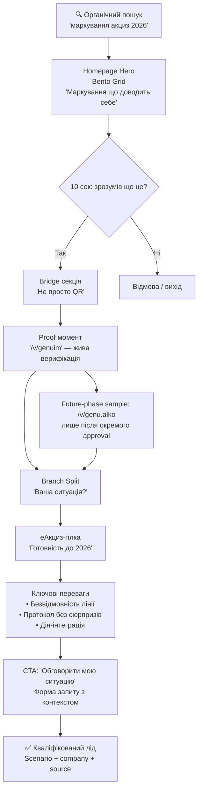
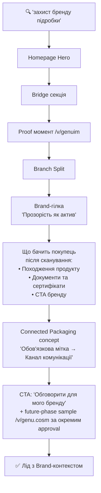
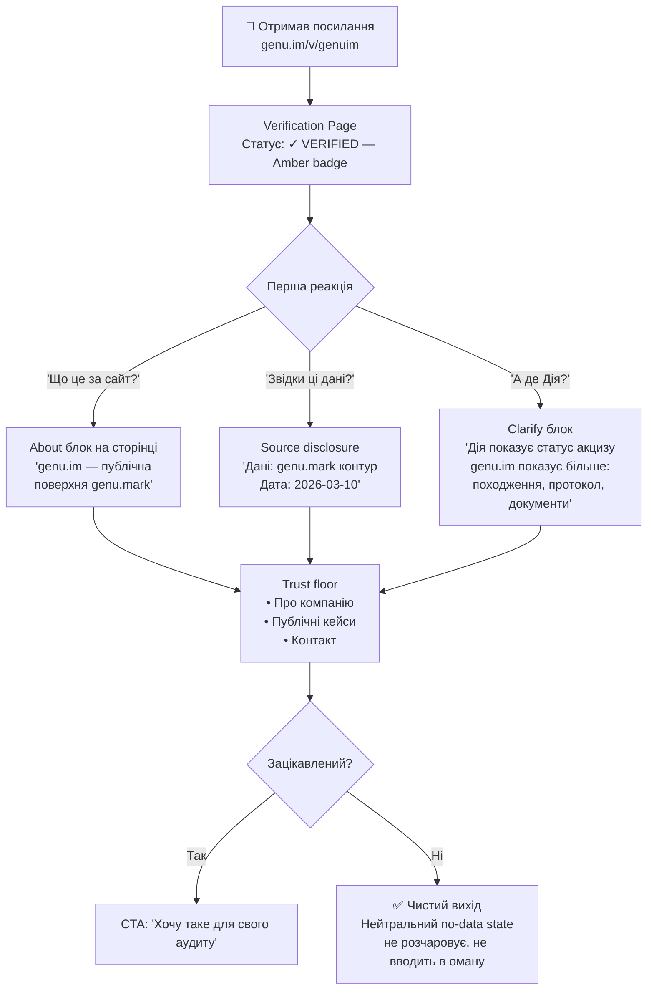
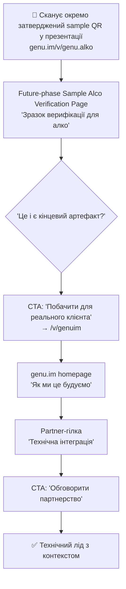
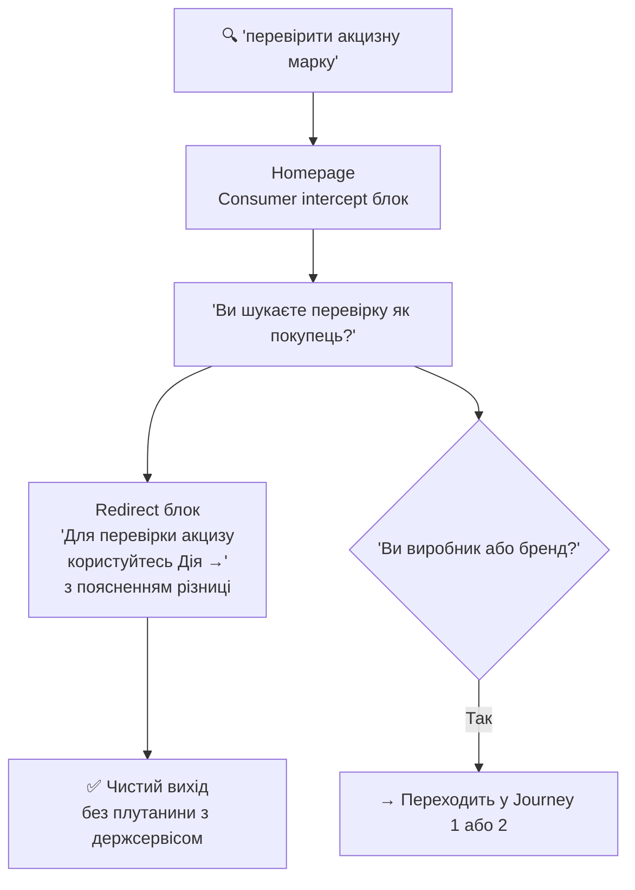

# UX Design Specification gm

**Author:** GenuIm
**Date:** 2026-03-10

---

<!-- UX design content will be appended sequentially through collaborative workflow steps -->

## Executive Summary

### Project Vision

genu.im — proof-first публічна поверхня для виробничого контуру маркування genu.mark. Фаза 1 трансформує головну сторінку у компактну нарратив-воронку: пояснити категорію → bridge (не просто QR) → показати верифікацію → розділити гілки → підтримати конверсію у кваліфікований запит. Довіра будується дією, а не заявами.

### Target Users

**Первинні:**
- **Олег (COO/Compliance)** — виробник, готується до eАкциз-2026. Біль: збої, хаос у даних, штрафні ризики. Мова: "протокол, а не обіцянки".
- **Андрій (інженер/IT)** — відповідає за стабільність лінії. Біль: нестабільність, ручні фікси. Мова: "не ламається — значить, успіх".

**Вторинні:**
- **Ірина (бренд-менеджер)** — публічний артефакт довіри для партнерів/ритейлу.
- **Сергій (закупка/аудит)** — швидке підтвердження легальності за посиланням.

### Key Design Challenges

1. **10-секундна ясність на першому екрані** — пояснити незнайому B2B-категорію без перевантаження до того, як користувач піде
2. **Розділення Дія vs. genu.mark** — інтуїтивно, без юридичних застережень, не мімікруючи під держсервіс
3. **Дві аудиторії, одна сторінка** — eАкциз (compliance, risk) і Brand (voluntary, value) треба спіймати та розвести у свої гілки без плутанини

### Design Opportunities

1. **Proof-first як інтерактивний момент довіри** — жива верифікація `/v/genuim` як якірний UX-паттерн замість статичного "як це працює"
2. **No-data state як USP** — чесне "даних немає" підсилює довіру у скептиків-закупників
3. **Sequential persuasion** — візуальне втілення нарративної воронки: Hook → Clarify → Prove → Branch → Convert → Trust

### Current State Assessment

Поточний сайт має сильний візуальний фундамент, але критично не реалізує proof-first стратегію: `/v/genuim` — 404, bridge-секція відсутня, trust-floor destinations недоступні, CTA веде на mailto без захоплення контексту. Нарративний порядок не відповідає PRD (Use Cases ідуть до верифікації).

**Ключові прогалини:**
- `/v/genuim` — 404, proof-first entry point не існує
- Немає bridge-секції ("чому це не просто QR-лендінг")
- Немає trust-floor destinations: About, Privacy, Terms, FAQ
- Немає кваліфікованої форми запиту (тільки mailto:)
- Немає нейтрального no-data стану
- Дія не згадується — немає розділення genu.mark vs. офіційна держ. перевірка
- Нарративний порядок: Use Cases ідуть ДО proof (має бути навпаки)

## Core User Experience

### Defining Experience

Ключова дія, що визначає цінність genu.im: відвідувач відкриває верифікаційний запис `/v/genuim` і бачить реальний proof — перехід від "вони обіцяють" до "вони доводять". Все інше працює як підготовка до цього моменту або як конверсія після нього.

### Platform Strategy

- Статичний вебсайт (GitHub Pages, без SSR, без фреймворку)
- Первинний пристрій: desktop (COO, інженер вивчає контрагента), mobile критичний для аудиту/закупки "на місці"
- Інтерактивність реалізується через легкі JS-контролери без фреймворків
- Responsive-first: ключові потоки працюють від 360px до 1440px+

### Effortless Interactions

- CTA → верифікація: нуль зайвих кліків, прямий шлях
- Вибір гілки (eАкциз / Brand): візуальна метафора, самоочевидна без читання
- Форма запиту: мінімум полів, сценарій передзаповнений з обраної гілки
- Розділення Дія / genu.mark: читається інтуїтивно, не потребує пояснень

### Critical Success Moments

1. **Перший екран (0–10 сек)**: зрозумів "маркування + верифікація для виробників" — до того, як піде
2. **Верифікаційний момент**: відкрив `/v/genuim` → побачив реальний запис → "хочу таке для свого продукту"
3. **Branch recognition**: "eАкциз — це про мене" — впізнав себе без зусиль
4. **Request conversion**: заповнив форму за 30 сек з потрібним контекстом

### Experience Principles

1. **Proof before promise** — кожен екран рухає до доказу, не до заяви
2. **Zero ambiguity on role** — у будь-якій точці ясно: genu.mark ≠ Дія, це виробничий шар
3. **Branch self-selection without effort** — впізнавання через паттерн, не через читання
4. **Friction only where it matters** — форма вимагає контексту один раз, все інше безшовно

## Desired Emotional Response

### Primary Emotional Goals

Головна емоція: спокійна впевненість — "я бачу доказ, мені не треба вірити на слово". Не захват, не ажіотаж — це B2B compliance-продукт. Користувач має йти з відчуттям контролю та передбачуваності.

### Emotional Journey Mapping

- Перший екран → Впізнавання ("це для таких як я")
- Bridge → Цікавість ("хочу побачити доказ")
- `/v/genuim` → Впевненість ("реально, працює")
- Вибір гілки → Самоідентифікація ("eАкциз — моя історія")
- Форма → Готовність ("знаю чого очікувати")
- No-data state → Повага ("вони чесні, не ховають")
- Повторний візит → Надійність ("все на місці")

### Micro-Emotions by Persona

- Олег (COO): контроль і передбачуваність
- Андрій (інженер): компетентність системи
- Ірина (бренд): гордість за артефакт довіри
- Сергій (закупка): ясність без питань

### Design Implications

- Впевненість → proof-first порядок, реальні дані
- Впізнавання → конкретна мова персон у hero
- Спокій → мінімалістичний layout, whitespace
- Повага до чесності → explicit no-data state, demo-mode label
- Готовність → форма 4–5 полів, конкретні labels, один крок
- Компетентність → технічні терміни як сигнали розуміння лінії

### Emotional Design Principles

1. **Quiet confidence over excitement** — B2B-довіра будується тишею, а не енергетикою
2. **Honesty as design element** — явне "немає даних" сильніше, ніж прихована помилка
3. **Recognition before conversion** — користувач має впізнати себе ДО будь-якого CTA
4. **Calm the compliance anxiety** — мова і структура знижують тривогу про ризики eАкциз

## UX Pattern Analysis & Inspiration

### Inspiring Products Analysis

**Linear.app** — темний фон + єдиний акцент, живий UI як частина дизайну, sequential scroll narrative, generous whitespace, типографіка як візуальний елемент.

**Veriff** — trust через візуальну конфіденційність, verification iconography "читається" без слів, числа + інфографіка = доказ, зелений бренд як "живий колір".

**Контекст 2026:** Bento grid, kinetic typography, SVG-інфографіка як пояснення, ambient glow, scroll-triggered reveal, data visualization as design.

### Transferable UX Patterns

- **DataMatrix як дизайн-мотив** — геометричний код як текстура, фон, ілюстрація
- **Production flow SVG** — лінія → serialization → код → скан → результат як горизонтальна інфографіка замість текстових кроків
- **Bento branch split** — eАкциз і Brand як асиметричні блоки з різним visual treatment
- **Вбудований verification UI** — `/v/genuim` як живий екран у лендінгу
- **Kinetic counter** — 25M+ рахується при вході у viewport
- **Minimal sticky nav** → solid при скролі

### Anti-Patterns to Avoid

- Generic gradient SaaS-естетика — не відповідає compliance-серйозності
- Булети замість образів та інфографіки
- Стокові ілюстрації з людьми
- Агресивні CTA кожні 200px
- Feature grid без наративу
- Дія як візуальна домінанта — тільки точкове згадування в контексті гілки eАкциз

### Design Inspiration Strategy

**Адаптувати:**
- Linear scroll narrative → доказова нарратив-воронка genu.im
- Veriff verification iconography → DataMatrix + proof checkmark language
- Bento grid → branch split section

**Прийняти:**
- "Show through embedded UI" (як Linear показує продукт)
- Kinetic numbers (як Veriff показує scale)
- Minimal nav, generous whitespace

**Уникати:**
- Linear's product-darkness (у genu.im є світла версія — зберегти dual theme)
- Veriff's enterprise-heaviness (genu.im має залишатися founder-intimate)

## Design System Foundation

### Design System Choice

Кастомна дизайн-система на базі Tailwind CSS v4 без сторонніх component libraries. Розширена `@theme` система токенів забезпечує візуальну унікальність при збереженні продуктивності статичного сайту.

### Rationale for Selection

- Tailwind v4 вже встановлений і налаштований — розширення, а не заміна
- Сторонні бібліотеки (MUI/Chakra) додають JS-вагу несумісну з Lighthouse ≥97 і статичною архітектурою
- Linear і Veriff будували власну дизайн-мову — це наш шлях до візуальної унікальності
- Повний контроль над dark/light theme, motion, і новими паттернами

### Implementation Approach

- Розширити `site/assets/css/input.css` новими токенами в `@theme`
- DataMatrix SVG motif як reusable asset у `site/assets/img/`
- Flow diagram SVG система для inline ілюстрацій
- Kinetic counter як легкий JS-контролер
- Bento grid через Tailwind utility класи + CSS Grid
- Ambient glow через CSS `box-shadow` + custom token

### Customization Strategy

**Нові токени:**
- `--color-proof`: verification green accent
- `--color-surface-*`: 4-level surface system
- `--shadow-glow-proof`: ambient green glow
- `--radius-bento`: bento cell radius (24px)
- `--tracking-label`: uppercase letter-spacing для міток

**Нові паттерни:**
- `.bento-grid`: asymmetric grid layout
- `.section-dark` / `.section-light`: narrative контраст
- `.verification-ui`: styled proof page preview
- `.flow-diagram`: production flow infographic container
- `.kinetic-number`: animated counter wrapper

## Defining Experience

### 2.1 Defining Experience

"Відкрив посилання → побачив реальний proof → зрозумів цінність за 10 секунд." Ключовий інсайт: сам сайт IS продукт. Лендінг — це не опис genu.mark, це його демонстрація. Відвідувач не читає про proof — він переживає його.

### 2.2 User Mental Model

Поточна модель: "надішліть КП / поясніть по телефону". Бажана: "доведіть що це працює ДО того, як я витрачу час". Конфлікт: сайт каже "we prove", але /v/genuim — 404. Потрібно усунути.

### 2.3 Success Criteria

1. Hero CTA веде на /v/genuim — прямий, без зайвих кроків
2. Verification preview в hero кликабельний — є запрошенням, не лише ілюстрацією
3. Після кліку — чистий перехід на /v/genuim (окрема сторінка, окремий deliverable)
4. Без акаунту, без скачування, без QR-сканера

### 2.4 Novel UX Patterns

- "Лендінг = proof artifact" — сторінка сама є прикладом продукту; verification preview в hero візуально сигналізує: "те що ти бачиш — це і є те, що отримає твій покупець"
- No-data state як USP — окремий deliverable для /v/ (out of scope тут)

### 2.5 Experience Mechanics

**Initiation:** Hero primary CTA + кликабельний verification preview → обидва ведуть на /v/genuim.

**Interaction (homepage scope):** Клік на preview або CTA → чистий перехід на /v/genuim. Жодного inline-контенту, жодного iframe.

**Completion:** Після повернення з proof → branch CTA → форма.

**Out of scope (окремий deliverable):** /v/genuim — дизайн verification page, demo-mode banner, labeled facts, no-data state, evidence links.

## Visual Design Foundation

### Color System

**Brand (існуючий):** proof-green-light `#0d8a4f` / proof-green-dark `#00e676`

**Новий акцент — Verification Amber:**
`#c97a0a` (light) / `#ffb340` (dark)
Семантика: certified, proven, checked — badge, checkmark, kinetic numbers

**Light surfaces:** surface-base `#f7f6f2` / card `#ffffff` / subtle `#f0efe9`
**Dark surfaces:** base `#0c1410` (лісовий зелений) / card `#121f17` / raised `#1a2e20`
**Ambient glow:** proof `rgba(13,138,79,0.15)` / amber `rgba(255,179,64,0.12)`

### Typography System

**Шрифт: Manrope Variable**
- Геометричний + теплий, ідентичний шарп на латиниці та кирилиці
- Variable font — один файл всіх вагів (300→800)
- Резонує з українською tech-аудиторією

| Роль | Розмір | Вага |
|------|--------|------|
| Display | 72–96px | 700–800 |
| H1 | 48–56px | 700 |
| H2 | 32–40px | 600 |
| H3 | 22–26px | 600 |
| Label | 11–12px UPPER | 600 |
| Body | 16–18px | 400 |
| Mono | system-mono | 400 |

### Spacing & Layout Foundation

- Base unit: 4px
- Section spacing: 48–128px токени
- Bento gap: 16px / cell radius: 20–28px
- Grid: 12 col desktop / 8 tablet / 4 mobile, max 1280px
- Section rhythm: light ↔ dark чергування як візуальний нарратив

### Accessibility Considerations

- Proof green `#0d8a4f` на white: контраст 4.8:1 ✅ WCAG AA
- Amber `#c97a0a` на white: контраст 4.5:1 ✅ WCAG AA
- Dark mode: всі текстові пари ≥4.5:1
- Manrope: мінімум 16px body, label uppercase не менше 11px
- Touch targets: ≥44×44px на всіх інтерактивних елементах

---

## Design Direction Decision

### Design Directions Explored

Для genu.im було досліджено 6 візуальних напрямків:

| # | Назва | Характер |
|---|-------|---------|
| D1 | **Dark Forest** | Темний лісовий фон, ambient green glow, editorial типографіка |
| D2 | **Proof Light** | Чиста світла поверхня, мінімалізм, акцент на документах |
| D3 | **Bento Hero** | Bento grid layout, модульні картки, щільна інформаційна ієрархія |
| D4 | **Gradient Drama** | Динамічні градієнти, кінетичні елементи, максимальний impact |
| D5 | **Monolith** | Монолітний темний дизайн, ultra-dense, zero decoration |
| D6 | **Editorial Split** | Двоколонний editorial, текст + доказ паралельно |

### Chosen Direction

**D3 (Bento Hero) + D1 (Dark Forest) — гібридний підхід**

- **Основа:** D3 Bento Hero — bento grid layout на hero-секції, де кожна картка є окремим proof-моментом (кількість міток, статус верифікації, coverage map)
- **Атмосфера:** D1 Dark Forest — темний фон `#0c1410`, ambient green glow, лісова глибина як метафора надійності та органічного походження
- **Типографіка:** Editorial контраст — thin label + ultra-bold headline (Manrope Variable 300→800)
- **Акцент:** DataMatrix як фірменний декоративний мотив у hero

### Design Rationale

**Чому D3 + D1:**

1. **Proof-first через bento** — bento grid дозволяє одночасно показати кілька proof-сигналів (цифри, статуси, карта) без scrollу, що відповідає 10-секундній вимозі першого екрану
2. **Dark Forest = довіра** — темний фон з ambient glow асоціюється з enterprise-рівнем, серйозністю та технологічністю (Linear.app effect), не плутається з держсервісами (Дія — light/white)
3. **Диференціація від конкурентів** — більшість B2B compliance SaaS = white/blue корпоратив; темний ліс + amber verification = унікальний та запам'ятовуваний
4. **Модульність bento** — кожну картку можна адаптувати для різних аудиторій (eАкциз vs Brand) без перебудови layout

**Principal Designer рекомендації (прийняті та зафіксовані):**

- **Типографічний контраст:** label thin 300 + headline ultra-bold 800 — на одному блоці для максимального impact
- **DataMatrix як DNA-мотив:** ненав'язливо присутній у hero як декоративний елемент, що підкреслює технологію без пояснень
- **VW stagger animation:** числа верифікацій "рахуються" при scroll-in (Intersection Observer), створюючи момент довіри
- **Семантика Green/Amber:** Green = brand identity (хто ми), Amber = verified moment (доведено зараз)
- **Bridge "Not just QR" section:** окрема секція між hero та proof, яка пояснює різницю між звичайними QR-кодами та genu.mark
- **Branch visual DNA split:** eАкциз-гілка використовує cold tones + document iconography; Brand-гілка — warm amber + storytelling
- **Horizontal SVG flow infographic:** замість вертикального списку кроків — горизонтальна SVG-стрілка з 4 вузлами (Print → Scan → Verify → Report)
- **Micro-motion принципи:** hover lift 4px на bento картках, transition 200ms ease-out, focus ring 2px offset

### Implementation Approach

**Hero Section (Bento Grid):**
```
[ Headline + sub ]  [ VW counter: 12,847 ]
[ DataMatrix glow ] [ Coverage map UA    ]
[ "Try verify →"  ] [ Status: ✓ VERIFIED ]
```

**Section rhythm (light ↔ dark чергування):**
1. Hero — dark forest
2. Bridge "Not just QR" — dark forest variant
3. Verification Live — dark + amber accent
4. Branch split (eАкциз / Brand) — dual surface
5. How it works (SVG flow) — light surface
6. Trust floor (logos, numbers) — light surface
7. CTA + Contact — dark forest

**CSS токени під обраний напрямок:**
- `--surface-forest: #0c1410`
- `--surface-forest-card: #121f17`
- `--glow-green: rgba(13,138,79,0.15)`
- `--glow-amber: rgba(255,179,64,0.12)`
- `--font-display: 'Manrope Variable', sans-serif`
- `--weight-thin: 300`
- `--weight-ultra: 800`

---

## User Journey Flows

### Загальна модель переконання

Всі journeys рухаються по одній нарративній воронці:

```
Hook → Clarify → Bridge → Prove → Branch → Convert → Trust
```

**Точки входу:**
- 🔍 Органічний пошук Google → homepage
- 🔗 Пряме посилання (від менеджера, партнера, статті) → homepage
- 📱 QR-код на продукті → `/v/{code}` (302 redirect через delivr.com)
- 📧 Sample-посилання у листі/Telegram → окремо затверджений future-phase sample route, наприклад `/v/genu.alko`

---

### Journey 1: Виробник / eАкциз-ready (Олег, COO)

**Тригер:** Google "маркування акциз 2026" → homepage
**Мета:** Зрозуміти чи це надійно, чи не заплутає з Дією, подати запит



**Micro-moments:**
- Hero: число 25M+ рахується при scroll-in (VW stagger animation)
- Bridge: SVG flow "Принтер → DataMatrix → Скан → Дія ✓" — горизонтальна інфографіка
- Proof: DataMatrix badge пульсує — "цей код живий"
- Branch: два великих блоки з іконографікою (завод/протокол vs. бренд/прозорість)

**Ключове уточнення:** `Дія` і `genu.mark` — різні trust-шари. `Дія` використовується для офіційної перевірки акцизу, а `genu.mark` / `genu.im` показують виробничий і бренд-доказ без мімікрії під держсервіс.

---

### Journey 2: Бренд-власник (Ірина, Brand Manager)

**Тригер:** "захист бренду маркування підробки" → homepage → Brand-гілка
**Мета:** Знайти артефакт довіри, який можна показати партнеру/ритейлу



**Ключовий інсайт:** Ірина хоче артефакт, який можна *показати* партнеру. Sample QR у презентації — це і є її момент успіху. Обов'язкова мітка (cost center) стає каналом комунікації (value center).

---

### Journey 3: Скептик-аудитор (Сергій, Procurement)

**Тригер:** Отримав посилання `/v/genuim` — очікує порожній маркетинг або overclaiming
**Мета:** Швидко підтвердити легальність, не бути обдуреним



**No-data state** (paste-first `/v/` без відомого коду):
> *"Цей код не зареєстрований у genu.mark. Це може означати що продукт не маркований через нашу платформу — або код введено невірно. Для офіційної перевірки акцизу → Дія."*

---

### Journey 4: Партнер / Інтегратор

**Тригер:** Менеджер надіслав посилання + окремо затверджений future-phase sample QR у презентації
**Мета:** Зрозуміти технічну надійність, оцінити як presales-актив



---

### Journey 5: Споживач (перехоплення і редирект)

**Тригер:** "як перевірити акцизну марку" → homepage
**Мета:** Не заплутати з держсервісом, чисто перенаправити



---

### Journey 6 (Future Phase): Sample Code Discovery

**Тригер:** Email/Telegram/презентація з окремо затвердженим sample-посиланням `/v/genu.alko`
**Мета:** Побачити живий артефакт для своєї галузі → конвертуватись

```mermaid
flowchart TD
    A[📧 Отримав окремо затверджене sample-посилання\n'Ось як виглядає верифікація\nдля алко-виробника'] --> B[/v/genu.alko\nFuture-phase Sample Alco Verification]
    B --> C[Бачить:\n✓ VERIFIED amber badge\nВиробник: Sample Alco Brand\nДата: 2026-03-10\nТип: Алкогольна продукція UA]
    C --> D{'Хочу таке для свого бренду'}
    D --> E[CTA: 'Обговорити для мого виробництва'\nз prefill: sector=alco]
    E --> F[✅ Кваліфікований лід\nз галузевим контекстом]
    C --> G{'Хочу переконатись що це надійно'}
    G --> H[→ /v/genuim\nПлатформа верифікує саму себе]
    H --> I[✅ Довіра отримана\nMeta-верифікація]
```

---

### Концепція "Живі Зразки Довіри" (Live Trust Samples, Future Phase)

Передвизначені sample-коди як future-phase маркетинговий та presales-інструмент. Вони не входять до implementation-ready Phase 1 baseline без окремого затвердження.

| URL | Призначення | Використання |
|-----|------------|-------------|
| `/v/genuim` | Платформа верифікує саму себе | Homepage proof anchor, presales pitch |
| `/v/genu.alko` | Зразок для алко-виробника | Future-phase email, комерційні пропозиції для алко |
| `/v/genu.cosm` | Зразок для косметики | Future-phase презентації для beauty/pharma |

**Механіка кожної sample-сторінки (після окремого затвердження):**
- DataMatrix QR — сканується, веде сюди (доводить що код "живий")
- Статус `✓ VERIFIED` — amber moment довіри
- Source disclosure — "Дані: genu.mark контур, Дата: [timestamp]"
- "Що це?" inline блок — онбординг прямо зі сторінки
- CTA — "Хочу таке для мого виробництва →" з prefill сценарію

**Використання QR-кодів зразків:**
- 📊 **Презентації:** QR на слайді → клієнт сканує під час пітчу → бачить живу верифікацію
- 📧 **Email/Telegram:** посилання замість тексту — показуємо, не розповідаємо
- 🏪 **Виставки/заходи:** фізичні DataMatrix-стікери на стенді
- 📄 **Комерційні пропозиції:** PDF з QR → клієнт сканує → потрапляє в галузевий sample
- 🤝 **Онбординг клієнтів:** "Ось як виглядатиме ваша верифікація"

**Meta-верифікація `/v/genuim`:**
> *"Ця платформа настільки впевнена у своєму продукті, що верифікує саму себе. Кожна мітка, яку ми ставимо — має такий самий артефакт."*

---

### Аудит іконографіки (до виправлення в Step 11)

Поточна іконографіка сайту потребує перегляду на відповідність та уместність:

| Контекст | Проблема | Правильний напрямок |
|----------|---------|-------------------|
| eАкциз / Compliance | Абстрактна іконка без зв'язку з законом | ⚖️ протокол / 📋 документ / ✓ checkmark |
| Верифікація | Статична галочка — не передає дію перевірки | 🔍 + amber badge — "дія перевірки" |
| Маркування | Абстрактний тег/наліпка | ▦ DataMatrix — реальний артефакт |
| Бренд-захист | Щит (агресивна конотація) | 👁️ прозорість / 🌿 органічність |
| Інтеграція | Шестерня (занадто технічно) | 🔗 з'єднання / ↔️ протокол |
| Надійність/Uptime | Зірки або емодзі сили | 📊 uptime chart — доказ, не заява |

Повний іконографічний аудит та нова іконна система — частина Step 11 (Component Strategy).

---

### Journey Patterns

**Навігаційні паттерни:**
- **"Proof anchor"** — завжди є шлях до `/v/genuim` як точки довіри з будь-якої секції
- **"Branch in scroll"** — eАкциз і Brand-гілки є секціями scroll-narrative homepage, не пунктами TopNav; footer містить anchor-посилання на обидві гілки
- **"Sample shortcut"** — з кожної галузевої секції — посилання на відповідний sample

**Паттерни рішень:**
- **"Show don't claim"** — замість "ми надійні" → "ось код, скануй"
- **"Honest no-data"** — відсутність даних = чесна відповідь, не помилка і не маркетинг
- **"Дія clarify"** — в кожному місці де є ризик плутанини — inline роз'яснення різниці

**Паттерни зворотного зв'язку:**
- VW counter на ключових числах (25M+, кількість верифікацій) — рахується при scroll-in
- Amber badge пульсує при першому рендері verification page
- SVG flow підсвічує поточний крок при scroll (Bridge секція)
- Hover lift 4px на bento картках, transition 200ms ease-out

---

## Component Strategy

### Технологічна база

genu.im будується на **Tailwind CSS v4** (CSS-first, без UI-бібліотеки) + **ванільний JS** (DOM-first controllers). Готових компонентних бібліотек не використовується — всі компоненти будуються з дизайн-токенів і утиліт.

**Доступно з Design System (Step 6 + 8):**
- Токени: кольори, типографіка Manrope Variable, spacing, тіні, ambient glow
- Tailwind utility classes: grid, flex, spacing, typography, transitions
- CSS кастомні варіанти: `dark`, custom variants

### Аналіз потреб по секціях

| Секція | Компоненти |
|--------|-----------|
| Hero (Bento Grid) | BentoCard, VerificationBadge, AnimatedCounter, DataMatrixGlyph |
| Bridge "Не просто QR" | SVGFlowDiagram, CompareRow |
| Verification Live | VerificationPage, StatusBadge, SourceDisclosure, NoDataState |
| Branch Split | BranchCard (×2), IconBlock |
| How it Works | HorizontalSVGFlow (4 вузли) |
| Trust Floor | LogoWall, StatBlock |
| CTA / Contact | RequestForm, SectorPrefill |
| Navigation | TopNav (3 елементи: logo, `[✓ Перевірити]`, `[Зв'язатись →]`) |
| Footer | LanguageToggle, ThemeToggle, trust links, anchor-посилання на гілки |
| Icons | IconSystem (повний аудит + нова система) |

### Кастомні компоненти — Специфікації

#### BentoCard

**Призначення:** Модульна картка bento-grid на hero — кожна показує один proof-сигнал

**Анатомія:**
```
┌─────────────────────────────┐
│ [LABEL uppercase 11px]       │
│                              │
│  [Primary content]           │
│  (число / карта / статус)    │
│                              │
│ [Sub-label або CTA]          │
└─────────────────────────────┘
```

**Варіанти:** `size-1x1` квадратна, `size-2x1` широка, `size-1x2` висока

**Стани:** default → hover (lift +4px, glow посилюється, 200ms ease-out) → focus (ring 2px offset)

**Accessibility:** `role="region"`, `aria-label` на кожну картку, числові значення в `aria-live` для counter

---

#### VerificationBadge / StatusBadge

**Призначення:** Amber "✓ VERIFIED" — центральний момент довіри на verification page і в hero

**Варіанти:** `hero` 64px з pulse-анімацією, `page` 40px, `inline` 20px у рядку

**Стани:** `verified` (amber glow), `pending` (neutral), `no-data` (muted, без amber)

**Анімація:** при першому рендері — scale 0.8→1.0 + opacity 0→1, duration 400ms ease-out

**Accessibility:** `role="status"`, `aria-label="Верифіковано genu.mark"`, `aria-live="polite"`

---

#### AnimatedCounter

**Призначення:** Числа "рахуються" при scroll-in — 25M+, кількість верифікацій (VW stagger)

**Механіка:** Intersection Observer → requestAnimationFrame → linear interpolation 0→target за 1200ms

**Варіанти:** `compact` (у bento картці), `display` (hero headline)

**Accessibility:** `aria-live="polite"` — фінальне значення доступне одразу для screen readers, анімація лише для зрячих

---

#### DataMatrixGlyph

**Призначення:** Декоративний DataMatrix як фірменний DNA-мотив платформи

**Реалізація:** SVG 21×21 grid, ambient green glow, opacity 0.6 default → 0.9 hover

**Використання:** hero bento картка, verification page фон, bridge секція

**Accessibility:** `aria-hidden="true"` (декоративний елемент)

---

#### SVGFlowDiagram (Bridge секція)

**Призначення:** Горизонтальна 4-вузлова інфографіка процесу

**Структура:**
```
[🖨 Принтер] →—→ [▦ Код] →—→ [📱 Скан] →—→ [✓ Дія]
   Маркування      genu.mark    Верифікація    Результат
```

**Анімація:** при scroll-in — стрілки "малюються" зліва направо (SVG stroke-dashoffset), вузли появляються з stagger 150ms

**Mobile:** вертикальний layout на < 768px

**Accessibility:** `role="img"`, `aria-label` описує весь flow текстом

---

#### VerificationPage (шаблон proof surface)

**Призначення:** Phase 1 baseline-шаблон для `/v/genuim`, який можна повторно використати для окремо затверджених named sample pages у наступних фазах

**Анатомія:**
```
┌──────────────────────────────────────┐
│ [Demo/Sample banner — якщо не live]  │
├──────────────────────────────────────┤
│ [DataMatrixGlyph]  [StatusBadge]     │
│ Виробник: [Name]                     │
│ Дата: [timestamp]                    │
│ Тип: [category]                      │
│ Джерело: genu.mark контур            │
├──────────────────────────────────────┤
│ [About inline: Що це? Чому довіряти?]│
├──────────────────────────────────────┤
│ [CTA: Хочу таке для мого виробництва]│
├──────────────────────────────────────┤
│ [Trust floor: Про компанію / Контакт]│
└──────────────────────────────────────┘
```

**Стани:** `demo` (з banner), `live` (без banner, Phase 3), `no-data` (нейтральний стан)

---

#### NoDataState

**Призначення:** Чесний нейтральний стан коли в `genu.im` немає публічного proof для цього коду. Це межа публічної surface, а не помилка, не підтвердження справжності, не юридичний висновок і не live lookup.

**Копія:**
> *"Для цього коду в `genu.im` зараз немає публічного proof. Це може означати, що публічний запис у цій surface зараз недоступний — або код введено невірно. `genu.im` не показує офіційний результат перевірки акцизу; для офіційної перевірки використовуйте Дія."*

**Якщо для цього результату є підтримані дані, тут можуть з'явитися лише такі блоки:**
- статус / result label
- source-labeled facts з контуру `genu.mark`
- відомості про продукт або категорію
- source disclosure (`джерело`, `timestamp`)
- NDA-safe evidence links або documents, якщо вони справді доступні

**Next steps:**
- `Дія ↗` — окремий external action тільки для official checking
- окремий business CTA до того самого request form із відповідним scenario prefill

**Заборони:** жодного червоного кольору, жодних "помилок", жодного overclaiming, жодних authenticity / legality / state-approval claims, жодних submission semantics, жодних live lookup semantics, жодних нових Phase 1 surfaces

**Додаткове правило:** показуються тільки підтримані proof blocks; порожні секції не рендеряться

**Accessibility:** `role="status"`, нейтральний тон, окремі й візуально розділені дії для `Дія` та business CTA, посилання на `Дія` в новій вкладці з `aria-label`

---

#### BranchCard

**Призначення:** Два блоки вибору на Branch Split секції — eАкциз або Brand

**Варіант A — eАкциз:**
- Іконка: `scales` ⚖️ (протокол/закон)
- Cold tones: `--surface-slate`
- CTA: "Обговорити еАкциз-контур"

**Варіант B — Brand:**
- Іконка: `eye` 👁️ (прозорість)
- Warm tones: amber accent
- CTA: "Обговорити захист бренду"

**Стани:** default → hover (border amber/green + lift) → focus

---

#### RequestForm

**Призначення:** Форма кваліфікованого запиту з контекстом

**Поля:** Ім'я контактної особи, Email або телефон, Компанія, Сценарій, Короткий контекст; приховані: `source_path`, опційний `proof_path`

**Стани:** empty → filled → handoff-pending → handoff / fallback → error

**Accessibility:** Всі поля з `<label>`, error з `aria-describedby`, `aria-invalid`

---

### IconSystem — Нова іконографіка

**Стиль:** лінійний (stroke 1.5px), не filled — відповідає Manrope thin/light регістру

**Розміри:** 16px inline, 24px UI, 40px feature, 64px hero/section

**Семантика кольору:** green для бренд-моментів, amber для verification, muted для нейтральних

| Контекст | Нова іконка | Обґрунтування |
|----------|------------|--------------|
| eАкциз / Compliance | `scales` ⚖️ | Закон і баланс, не виробництво |
| Верифікація | `magnifying-glass` + amber dot | Дія перевірки, не статичне "так" |
| Маркування | DataMatrix SVG ▦ | Реальний артефакт платформи |
| Бренд-прозорість | `eye` 👁️ | Видимість і довіра, не "щит" |
| Інтеграція/API | `plugs-connected` 🔗 | З'єднання, не механізм |
| Надійність/Uptime | `chart-line-up` 📈 | Доказ через дані, не заява |
| Виробнича лінія | `factory` мінімалістичний | Виробництво без агресії |
| Безпека | `shield-check` тонкий | Захист без "фортеця" конотації |
| Без даних | `question` нейтральний | Не "помилка", а "невідомо" |
| Партнер | `handshake` | Партнерство і співпраця |

**Правила:**
- Декоративні SVG: `aria-hidden="true"`
- Функціональні: `aria-label` або `<title>` всередині SVG
- Не мікс стилів: всі іконки з однієї системи (Phosphor Icons або кастомні SVG)

### Стратегія реалізації

**Підхід:** Tailwind v4 utility-first + мінімальний кастомний CSS для унікальних паттернів + ванільний JS DOM-controllers

### Дорожня карта реалізації

**Фаза 1 — Core (блокери Phase 1 launch):**
1. `VerificationPage` + `StatusBadge` + `NoDataState` → `/v/genuim` як canonical proof example
2. `BentoCard` + `AnimatedCounter` → Hero перший екран
3. `BranchCard` → Branch Split (конверсія)
4. `RequestForm` → CTA / лід-захоплення
5. `IconSystem` → аудит і заміна всіх іконок

**Фаза 2 — Enhancement:**
6. `SVGFlowDiagram` → Bridge секція
7. `DataMatrixGlyph` → декоративний DNA-мотив
8. `VerificationBadge` hero-variant з pulse

**Фаза 3 — Delight:**
9. `AnimatedCounter` з Intersection Observer
10. Stagger animations на bento grid
11. Named sample pages `/v/genu.alko`, `/v/genu.cosm` після окремого scope approval

---

## UX Consistency Patterns

### Ієрархія кнопок (Button Hierarchy)

| Рівень | Назва | Вигляд | Використання |
|--------|-------|--------|-------------|
| **Primary** | Proof CTA | Filled, amber або green | "Перевірити →", "Обговорити ситуацію" |
| **Secondary** | Navigate | Outlined, brand green | "Дізнатись більше", Branch-вибір |
| **Ghost** | Soft action | Text + arrow | "Читати далі", внутрішні переходи |
| **External** | Redirect | Text + `↗` icon | "Перевірити в Дія ↗", trust floor посилання |

**Правила:**
- Один Primary CTA максимум на одному екрані
- Primary: `min-width: 200px`, `min-height: 44px` (touch target)
- Hover: subtle lift 2px + brightness +5%
- Focus: ring 2px offset 2px, колір відповідає кнопці

---

### Feedback Patterns

| Тип | Тригер | Вигляд | Тон копії |
|-----|--------|--------|----------|
| **Handoff** | Поштовий клієнт відкрито або підготовлено чернетку | Muted amber / neutral info state | "Ми підготували чернетку листа з вашим запитом. Перевірте її та надішліть у вашому поштовому клієнті, якщо все правильно." |
| **Fallback** | Поштовий клієнт не відкрився | Neutral inline guidance | "Дані запиту залишилися на сторінці. Скористайтесь вказаним контактом або скопіюйте зміст запиту вручну." |
| **Error** | Форма невалідна | Inline під полем, червоний бордер | Конкретно: "Вкажіть назву компанії" |
| **Info** | Demo/Sample banner | Muted amber banner зверху сторінки | "Це демо-сторінка. Живі дані — після підключення." |
| **No-data** | Код не знайдено | Нейтральний сірий, без червоного | "Код не зареєстровано в genu.mark..." |

**Правила:**
- Ніколи не використовувати червоний для `no-data` — це не помилка, а чесна відповідь
- Feedback завжди inline — жодних модальних вікон для помилок форми
- `aria-live="polite"` для handoff/info/fallback, `aria-live="assertive"` для errors

---

### Form Patterns

**RequestForm — єдина форма Phase 1:**

```
Валідація: on-blur (не on-submit) — одразу після виходу з поля

Стани поля:
  default  → border subtle
  focus    → border brand-green + label float up
  filled   → border subtle + value visible
  error    → border red + inline message під полем
  success  → border green + checkmark icon
```

**Prefill паттерн:** `?scenario=` або branch-driven default веде в той самий request form і автоматично підставляє відповідний сценарій у форму; це змінює лише видимий контекст запиту, а не механізм handoff

**Submit flow:**
1. Клік → кнопка: spinner + "Відкриваємо email..." (disabled)
2. Якщо client environment supports `mailto:` → відкривається передзаповнений лист; сторінка може показати inline handoff info, але не стверджує що запит уже надіслано
3. Якщо `mailto:` недоступний або не відкрився → форма залишається на місці, усі значення видно, показано явний fallback contact next step
4. Якщо дані невалідні → handoff не ініціюється, проблемні поля пояснюються inline

---

### Navigation Patterns

**TopNav поведінка:**
- Desktop: горизонтальна, `sticky`, backdrop-blur при scroll > 20px
- Mobile: hamburger → drawer справа, `aria-expanded`, backdrop overlay
- Активний розділ: підкреслення amber (не зміна кольору тексту)

**Scroll-triggered стани:**
```
0px       → Nav transparent, hero повністю видно
>20px     → Nav: backdrop-blur dark + border-bottom subtle
>80% page → "Back to top" FAB з'являється (bottom-right, 44×44px)
```

**In-page anchor links:** `scroll-behavior: smooth`, offset 80px (висота sticky nav)

---

### Loading States

| Ситуація | Паттерн |
|----------|---------|
| Форма handoff | Кнопка: spinner + "Готуємо email..." (disabled) |
| Verification page (майбутнє) | Skeleton screen — контури контенту |
| AnimatedCounter scroll-in | Число рахується від 0 — контекстне "завантаження" |

**Правило:** Жодних full-page spinners. Тільки inline/contextual indicators.

---

### Empty States

| Контекст | Паттерн |
|----------|---------|
| `/v/` — код не введено | Input з placeholder "Введіть код або відскануйте" + приклад-посилання |
| `/v/{code}` — код не знайдено | `NoDataState` компонент (чесний, нейтральний) |
| Trust floor — немає кейсів | Секція не відображається (empty sections hidden per PRD) |

---

### Proof-Moments Pattern (специфічний для genu.im)

Унікальний паттерн платформи — моменти коли інтерфейс "доводить" а не "стверджує":

| Proof-moment | Тригер | Ефект |
|-------------|--------|-------|
| VerifiedBadge появляється | Перший рендер `/v/` сторінки | scale + opacity + amber glow pulse |
| Counter рахується | Scroll до статистики | VW stagger, 1200ms |
| SVG flow малюється | Scroll до Bridge секції | stroke-dashoffset, stagger 150ms |
| BentoCard hover | Hover на hero картці | lift 4px + glow посилюється |
| Branch selection | Hover на BranchCard | border amber/green + subtle background fill |

**Принцип:** анімація має єдину ціль — підсилити момент довіри. Ніякої анімації заради анімації.

---

### Mobile Interaction Patterns

| Елемент | Desktop | Mobile |
|---------|---------|--------|
| Bento Hero | 3-колонний grid | 1 колонка, картки вертикально |
| SVGFlowDiagram | Горизонтальний | Вертикальний |
| BranchCard | Side-by-side | Стек вертикально |
| RequestForm | 2-колонні поля | 1 колонна, повна ширина |
| TopNav | Горизонтальна | Drawer справа |

**Breakpoints:**
```
mobile:  360px–767px   → 4-col grid
tablet:  768px–1279px  → 8-col grid
desktop: 1280px+       → 12-col grid, max-width 1280px
```

**Touch targets:** ≥44×44px на всіх інтерактивних елементах без винятків

---

### Language & Theme Patterns

- **Перемикач мови:** у **footer** (Phase 1), у user profile dropdown (Phase 3 після авторизації), `aria-label="Змінити мову"`, зберігається в `localStorage` (try/catch)
- **Перемикач теми:** у **footer** (Phase 1), у user profile dropdown (Phase 3 після авторизації), `aria-pressed`, зберігається в `localStorage` (try/catch)
- **FOUC prevention:** тема і мова застосовуються в `<head>` до рендеру контенту
- **Fallback:** `localStorage` недоступний → системні налаштування для теми, `uk` для мови

---

## Responsive Design & Accessibility

### Responsive Strategy

**Mobile-first підхід** — дизайн починається з 360px (мінімум PRD), масштабується вгору.

**Чому mobile-first для genu.im:**
- Значна частина B2B трафіку в UA — з мобільного (перевірка посилань з Telegram/Viber)
- QR-сканування → `/v/{code}` завжди мобільне за природою
- Lighthouse Mobile — окремий CI performance gate

| Пристрій | Layout | Nav | Bento | Branch Cards |
|----------|--------|-----|-------|-------------|
| Mobile 360px | 1 колонка | Hamburger drawer | Вертикальний стек | Вертикально |
| Tablet 768px | 2 колонки | Скорочена горизонтальна | 2-col | Side-by-side |
| Desktop 1280px+ | 12-col grid | Повна горизонтальна | 3-col | Side-by-side |

### Breakpoint Strategy

```css
@theme {
  --breakpoint-sm: 360px;   /* мінімум PRD */
  --breakpoint-md: 768px;   /* tablet PRD */
  --breakpoint-lg: 1280px;  /* desktop PRD */
  --breakpoint-xl: 1440px;  /* wide screens */
}
```

**Fluid типографіка між breakpoints:**
```css
.hero-headline {
  font-size: clamp(2rem, 5vw, 4.5rem); /* 32px → 72px */
}
```

**Критичні перевірки:**

| Breakpoint | Що перевіряємо |
|-----------|---------------|
| 360px | Hero readable, primary CTA visible, nav працює, no horizontal scroll |
| 768px | Bento 2-col, branch cards side-by-side, form usable |
| 1280px | Full 12-col grid, всі анімації, max-width centered |

### TopNav Architecture

**Рішення: радикально мінімальний nav — 2026 рівень**

TopNav — не меню сайту. TopNav — одна точка входу і один вихід. Секції "eАкциз", "Бренд", "Як це працює" — не в nav, вони в scroll-narrative самої сторінки.

```
DESKTOP:
[genu.im ▦]                    [✓ Перевірити]   [Увійти*]   [Зв'язатись →]

MOBILE:
[genu.im ▦]                                     [Зв'язатись →]   [≡]
```

- `[✓ Перевірити]` — ghost/secondary, веде на `/v/` (proof hub, не конкретний sample)
- `[Увійти]` — зарезервовано в IA для Phase 3 auth layer, Phase 1: прихований або ghost/muted
- `[Зв'язатись →]` — єдиний primary CTA, завжди видимий
- Мова / Тема — **footer** (Phase 1) → **user profile dropdown** (Phase 3, після авторизації)

**Обґрунтування:** "Про нас", "Бренд", "еАкциз" в nav — це структурна навігація 2010 року. Користувач приходить з метою — перевірити або зв'язатись. Все інше — scroll.

### `/v/` Proof Hub — екран верифікації

**Дизайн-принцип: Google search рівень мінімалізму + Jonny Ive атмосфера**

Один гігантський DataMatrix позаду — центрований, майже весь viewport, opacity 3-4%. Input плаває поверх. Відчуття що ти буквально всередині коду.

```
┌─────────────────────────────────────────┐
│                                         │
│    ░▒▓ DataMatrix glyph ▓▒░             │
│    (viewport-size, opacity 3-4%)        │
│                                         │
│    [  Введіть або вставте код...  ] [→] │
│                                         │
│    [Спробувати приклад]  [Вставити код] │
│                                         │
└─────────────────────────────────────────┘
```

**Три елементи. Більше нічого.**
- Input — основна дія
- Example-code action — знизити поріг входу
- DataMatrix ambient — атмосфера і ДНК платформи

**Demo banner** — видимий з initial render на кожній non-live proof surface. На `/v/` він стоїть над input/result area, на `/v/genuim` — над proof content. Тон спокійний і неалармістичний.

**B2B CTA** — після результату верифікації, внизу. Не на вході.

### Accessibility Strategy

**Ціль: WCAG 2.1 AA** (PRD: NFR5, NFR6 — Lighthouse Accessibility ≥ 97)

#### Кольоровий контраст

| Пара | Контраст | Статус |
|------|---------|--------|
| Proof green `#0d8a4f` на white | 4.8:1 | ✅ AA |
| Amber `#c97a0a` на white | 4.5:1 | ✅ AA |
| White на `#0c1410` dark forest | 17.5:1 | ✅ AAA |
| Green `#00e676` на `#0c1410` | 8.2:1 | ✅ AAA |
| Amber `#ffb340` на `#0c1410` | 7.1:1 | ✅ AAA |

#### Семантична структура

```html
<a href="#main-content" class="sr-only focus:not-sr-only">
  Перейти до основного контенту
</a>
<header role="banner">       <!-- TopNav -->
<main id="main-content">     <!-- основний контент -->
<nav aria-label="Головна навігація">
<footer role="contentinfo">  <!-- мова, тема, trust links -->
```

#### Клавіатурна навігація (Tab order)

1. Skip to main content
2. TopNav: logo → `[✓ Перевірити]` → `[Увійти]` → `[Зв'язатись →]`
3. Hero: primary proof CTA
4. Branch cards (обидва досяжні Tab)
5. RequestForm fields → submit
6. Footer links (мова, тема, trust destinations)

#### Aria patterns

- `AnimatedCounter`: `aria-live="polite"` — фінальне значення доступне одразу для screen readers
- `VerificationBadge`: `role="status"` + `aria-label="Верифіковано genu.mark"`
- Mobile drawer: `aria-expanded`, `aria-controls`, focus trap при відкритті
- `SVGFlowDiagram`: `role="img"` + `aria-label` з повним текстовим описом flow
- `DataMatrixGlyph` (декоративний): `aria-hidden="true"`

#### Reduced Motion

```css
@media (prefers-reduced-motion: reduce) {
  .animated-counter,
  .bento-card,
  .svg-flow-animation,
  .verification-badge-pulse,
  .datamatrix-ambient { animation: none; transition: none; }
}
```

Всі proof-moment анімації вимикаються — контент залишається повністю доступним.

### Testing Strategy

**Автоматизоване (в CI):**
- Playwright accessibility audit → кожен smoke run
- Lighthouse CI → `accessibility >= 97` як release gate
- Jest + JSDOM → `aria-*` атрибути в unit тестах

**Мануальне (перед release):**

| Інструмент | Що перевіряємо |
|-----------|---------------|
| VoiceOver macOS/iOS | Повний page read, form interaction |
| NVDA Windows | Verification page, AnimatedCounter |
| Keyboard-only | Повний Tab journey: hero → branch → form submit |
| Chrome DevTools Color Blindness | Protanopia, Deuteranopia — proof moments читабельні |
| axe DevTools | WCAG 2.1 AA violations scan |

**Responsive testing:**
- Playwright mobile projects → 360px та 768px
- Реальний пристрій → Android Chrome (основний UA mobile browser)

### Implementation Guidelines

```css
/* Mobile-first grid */
.bento-grid {
  display: grid;
  grid-template-columns: 1fr;
}
@media (min-width: 768px) {
  .bento-grid { grid-template-columns: repeat(2, 1fr); }
}
@media (min-width: 1280px) {
  .bento-grid { grid-template-columns: repeat(3, 1fr); }
}

/* Touch targets */
.btn, .nav-link, .branch-card, .sample-shortcut {
  min-height: 44px;
  min-width: 44px;
}

/* Accessible form field pattern */
/* <label> + <input aria-required aria-describedby aria-invalid> + <p role="alert"> */
```

**Performance + accessibility разом:**
- Manrope Variable: один файл, `font-display: swap` → мінімум layout shift
- CSS-only анімації для декоративних ефектів — без JS overhead
- `content-visibility: auto` для off-screen секцій → швидший LCP
- Critical CSS inline в `<head>` → тема і мова без FOUC
