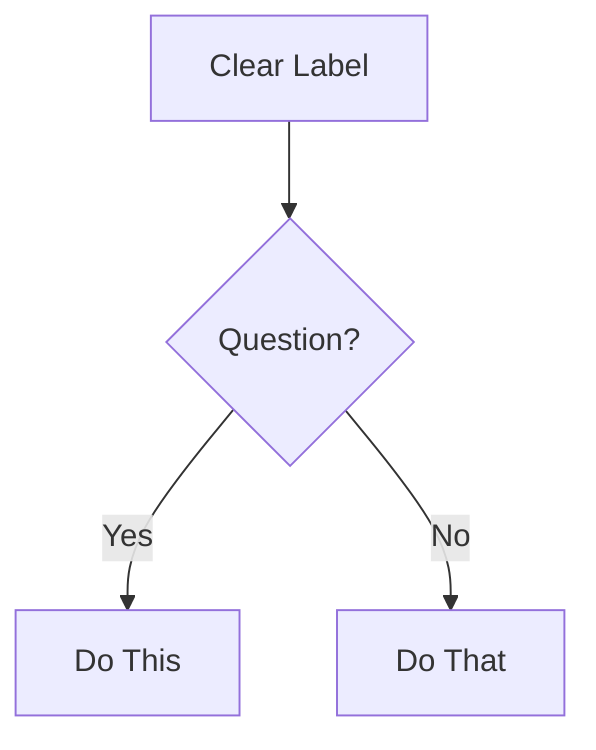

# Mermaid Diagrams: Valid Syntax Required

**Critical Rules:**

1. Always specify diagram type first line
2. Use valid Mermaid v10+ syntax
3. Test syntax before outputting (mental validation)
4. Keep focused: 5-10 nodes ideal, max 15

**Diagram Type Selection:**

- **flowchart** - Process flows, decision trees, workflows
- **sequenceDiagram** - API interactions, message flows, time-based processes
- **classDiagram** - Object models, class relationships, system structure
- **erDiagram** - Database schemas, entity relationships
- **stateDiagram-v2** - State machines, lifecycle stages
- **gitGraph** - Branch strategies, version control flows

**Formatting:**

````markdown

````
